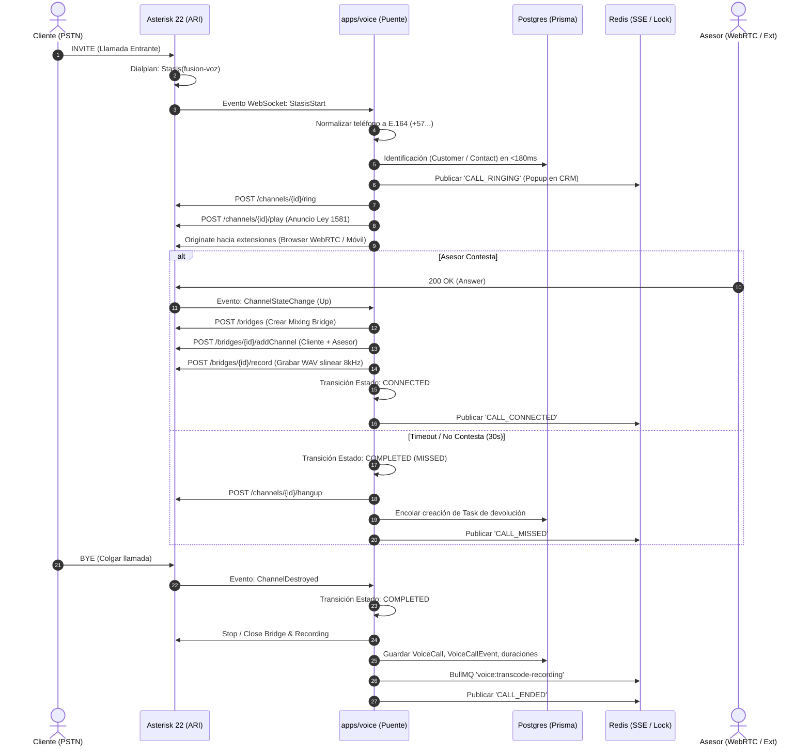

# Arquitectura del Módulo de Voz: Asterisk 22 LTS, ARI y FUSION CRM

> **Documento Técnico de Referencia — Etapa 17 (Sub-etapas 17.1, 17.2, 17.3)**  
> **Sistema**: FUSION ERP / CRM  
> **Servicio**: `apps/voice` (Puente ARI en Node.js / TypeScript)  
> **Motor Telefónico**: Asterisk 22.6.0+ LTS (chan_pjsip, chan_websocket, Stasis)

---

## 1. Visión General y Topología

El subsistema de voz está diseñado con un desacoplamiento estricto entre el motor de medios/SIP (Asterisk) y la lógica de negocio (CRM).
El servicio `apps/voice` corre en un proceso Node.js independiente, aislado del servidor web Next.js (`apps/web`), garantizando que los despliegues de la interfaz de usuario nunca interrumpan llamadas activas.

```
                  ┌────────────────────────────────────────┐
                  │          PROVEEDOR SIP TRUNK           │
                  └───────────────────┬────────────────────┘
                                      │ SIP / RTP (UDP)
                                      ▼
                  ┌────────────────────────────────────────┐
                  │    ASTERISK 22 LTS (network_mode: host) │
                  │  - chan_pjsip (Trunk & Extensiones)    │
                  │  - Dialplan: Stasis(fusion-voz)        │
                  │  - ARI REST / WebSocket (Puerto 8088)  │
                  └──────────────┬──────────────────┬──────┘
                                 │                  │
                ARI WS & REST    │                  │  chan_websocket
           (fusion-voz control)  │                  │  (Sub-etapa 17.7 IA)
                                 ▼                  ▼
      ┌─────────────────────────────────┐   ┌───────────────────────────┐
      │   PUENTE DE VOZ (apps/voice)    │   │  AGENTE DE VOZ IA (17.7)  │
      │  - Master Lock (Redis)          │   │  - Google Cloud / Deepgram│
      │  - Máquina de Estados Pura      │   └───────────────────────────┘
      │  - Identificación CRM (<180ms)  │
      │  - Ringing, Bridge, Recording   │
      └─────────┬──────────────┬────────┘
                │              │
         Redis Pub/Sub         │ Prisma ORM
        (fusion:voice:events)  │ (Async Queue)
                ▼              ▼
      ┌────────────────┐ ┌────────────────┐
      │  APPS/WEB SSE  │ │   POSTGRESQL   │
      │ (Kanban/Popups)│ │ (10-voz.prisma)│
      └────────────────┘ └────────────────┘
```

---

## 2. Diagrama de Flujo: Llamada Entrante (Inbound Call)



---

## 3. Máquina de Estados de la Llamada (`callMachine.ts`)

La máquina de estados es una función pura, inmutable y determinista: `(snapshot, targetState, payload, timestamp) => { snapshot, event }`.
Ninguna transición no permitida puede ejecutarse: de intentarse, lanza `VoiceInvalidStateTransitionError` sin mutar el snapshot previo.

### Estados Válidos
- `CREATED`: Llamada instanciada en memoria al recibir `StasisStart`.
- `RINGING`: Teléfono timbrando hacia el destino o extensiones.
- `IN_IVR`: Cliente interactuando con el menú interactivo (DTMF).
- `IN_QUEUE`: Cliente en espera en cola de atención con música on-hold.
- `IN_AI`: Conversando con el agente conversacional inteligente.
- `CONNECTED`: Canal puenteado en un mixing bridge bidireccional.
- `ON_HOLD`: Asesor puso en espera al cliente (MOH activo).
- `TRANSFERRING`: Proceso de transferencia ciega o atendida.
- `VOICEMAIL`: Grabando mensaje en buzón de voz.
- `COMPLETED`: Llamada finalizada normalmente (Hangup).
- `FAILED`: Llamada fallida (congestión, número inválido, rechazo).

### Matriz de Transiciones Permitidas

```
               ┌──────────┐
               │ CREATED  │
               └────┬─────┘
                    │
                    ▼
               ┌──────────┐
       ┌───────┤ RINGING  ├────────┐
       │       └────┬─────┘        │
       │            │              │
       ▼            ▼              ▼
┌──────────┐  ┌──────────┐   ┌───────────┐
│  IN_IVR  │  │ IN_QUEUE │   │ CONNECTED │◄────┐
└────┬─────┘  └─────┬────┘   └─┬───────┬─┘     │
     │              │          │       │       │
     ▼              ▼          │       ▼       │
┌──────────┐        │          │  ┌─────────┐  │
│  IN_AI   ├────────┘          │  │ ON_HOLD ├──┘
└────┬─────┘                   │  └─────────┘  │
     │                         │               │
     ▼                         │  ┌──────────────┐
┌───────────┐                  └──┤ TRANSFERRING ├─┘
│ CONNECTED │                     └──────────────┘
└────┬──────┘
     │
     ▼
┌───────────┐  /  ┌───────────┐
│ COMPLETED │     │  FAILED   │
└───────────┘     └───────────┘
```

---

## 4. Normalización Telefónica Colombiana (E.164)

Cumple con la Resolución CRC 5826 de 2020:
1. **Celulares (10 dígitos)**: `3001234567` ➔ `+573001234567`. Se eliminan prefijos obsoletos `03` o prefijos nacionales `57`.
2. **Fijos Nacionales (10 dígitos)**: `6068801234` ➔ `+576068801234`.
3. **Fijos Locales Manizales / Caldas (7 dígitos)**: Números locales de 7 dígitos (ej: `8801234`) se autocompletan con el código regional de Manizales (`+57606`): `+576068801234`.
4. **Números Anónimos**: Valores como `anonymous`, `private`, `0`, `unknown` se identifican como anónimos y devuelven `e164: null`.

---

## 5. Estrategia de Alta Disponibilidad y Failover

1. **Master Lock Distribuido en Redis**:
   - Clave: `fusion:voice:master-lock`
   - TTL: 10 segundos con heartbeat cada 3 segundos (`SET PX 10000 NX`).
   - Solo la instancia que posee el candado se suscribe al WebSocket de ARI.
   - Si la instancia primaria muere, el TTL expira en máximo 10s y la instancia secundaria asume el liderazgo sin intervención manual.

2. **Reconciliación y Limpieza de Fantasmas**:
   - Al conectar o reconectar tras caída de red, `apps/voice` consulta `GET /ari/channels` y `GET /ari/bridges` en Asterisk.
   - Cualquier llamada en `callRegistry` cuyo canal no exista en Asterisk es finalizada en la base de datos con causa `ORPHAN_CLEANUP`.
   - Evita canales huérfanos o contadores de llamadas activos infinitos.

---

## 6. Grabaciones y Cumplimiento Legal (Ley 1581 / SIC)

1. **Marco Legal**:
   - En Colombia, la Ley Estatutaria 1581 de 2012 y la Circular Externa 002 de la SIC exigen informar al titular que la llamada será grabada y tratada con fines de calidad y seguridad antes o inmediatamente al iniciar la grabación.
2. **Implementación Técnica**:
   - Antes de bridgear el canal, se reproduce el aviso de consentimiento legal mediante `POST /channels/{id}/play?media=sound:fusion/aviso_grabacion_ley1581`.
   - La grabación se ejecuta a nivel de **Bridge** (`POST /bridges/{id}/record`), grabando ambos sentidos (inbound y outbound) sincronizados en un solo archivo.
   - Formato inicial: WAV PCM 8kHz mono (`/var/spool/asterisk/recording/{callId}.wav`).
   - Al colgar, se despacha un trabajo a BullMQ (`voice:transcode-recording`) para transcodificar a MP3 32kbps mono, calcular hash SHA-256 de integridad y actualizar la duración en Postgres.

---

## 7. Identificación del Cliente (<180ms)

Para no retrasar el timbrado:
- Consulta en paralelo contra:
  1. `ContactPhone` / `Contact`
  2. `Customer` (teléfono directo)
- Si la consulta tarda más de 180ms, el timeout dispara la llamada con `customerId: null`, y una tarea en segundo plano asocia la llamada una vez resuelto.
- Detección de ambigüedad: si un teléfono pertenece a múltiples contactos, se marca como ambiguo para que el asesor seleccione el contacto correcto en el popup del CRM.

---

## 8. Guía de Solución de Problemas (Troubleshooting)

| Problema | Causa Raíz Frecuente | Solución Inmediata |
| :--- | :--- | :--- |
| **1. ARI rechaza conexión WebSocket (401 / Connection Refused)** | Credenciales incorrectas en `ari.conf` o bind address en `127.0.0.1`. | Verificar que `ari.conf` tenga `enabled = yes`, `allowed_origins = *` y que `ASTERISK_ARI_PASSWORD` coincida en el `.env`. |
| **2. Las llamadas entran pero cuelgan de inmediato** | Contexto del dialplan no llama a `Stasis(fusion-voz)` o el servicio no está corriendo. | Revisar `extensions.conf` en el contexto de entrada y verificar logs de Asterisk con `asterisk -rvvv` buscando `No application 'Stasis'`. |
| **3. Audio Unidireccional (One-Way Audio)** | Problemas de NAT / RTP traversal en Docker. | Asterisk DEBE correr con `network_mode: host`. Configurar `external_media_address` y `local_net` en `pjsip.conf`. |
| **4. Grabaciones vacías (0 bytes)** | Permisos de escritura en el volumen `/var/spool/asterisk/recording`. | Verificar que el usuario `asterisk` dentro del contenedor tenga permisos `chown -R asterisk:asterisk /var/spool/asterisk/recording`. |
| **5. Failover no conmuta o hay doble conexión** | Conectividad con Redis interrumpida o clock skew. | Validar que Redis esté accesible, revisar logs de `[MasterLock]` en `apps/voice` y verificar la clave `fusion:voice:master-lock`. |
